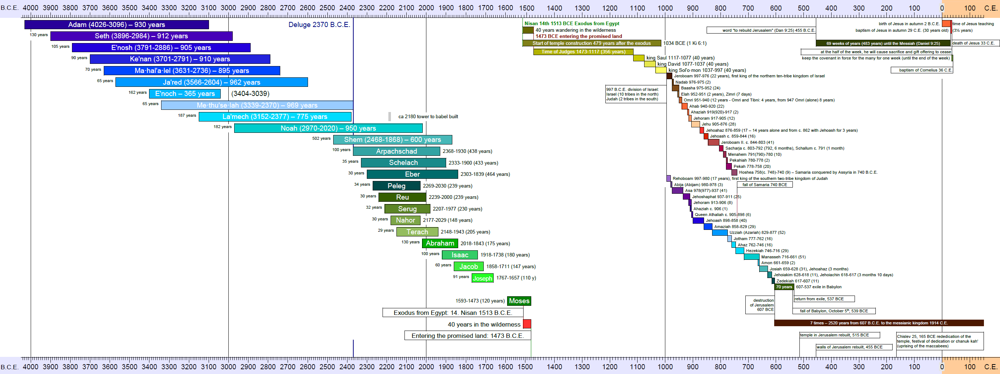

# A Timeline of human history

Human history graph created with python and reportlab. Version v3.5 replicates and expands the information of v1.1 with one single page. See both for comparison below.

## Reactivation 2023

After 14 years it was finally time to translate the project to English and share with my friends. In the years since beginning this project I learned a lot about programming languages, vector graphics and possible solutions using pandas, csv files and reportlab (instead of matplotlib). In a first stage I translated the old OpenOffice documents to english. Then I collected data into csv/tsv files for later automated processing and graph generation. This way the translation to another language is just the change of one import file. So far I translated the first page:

This project started on here on Github on June 10th, 2023. My last day of work.

## Version history

- v1.0 2009/02/10 An [OpenOffice spreadsheet](https://github.com/kreier/timeline/blob/5ffa9bac5cb4ff3c2cdc362b63df161e0d909c9d/spreadsheet/Zeitleiste_3A4_20090210.ods) with 260, 340 and 218 columns to create the overview with a resolution of 5 or 10 years. See the [resulting pdf](https://github.com/kreier/timeline/blob/5ffa9bac5cb4ff3c2cdc362b63df161e0d909c9d/spreadsheet/Zeitleiste_3A4_20090211.pdf). It contains 63 persons, 8 time periods and 20 events.
- v2.0 2015/10/12 A __vector image__ as a LibreOffice odf to cover 6000 years on [one pdf](https://github.com/kreier/timeline/blob/5ffa9bac5cb4ff3c2cdc362b63df161e0d909c9d/spreadsheet/Zeitleiste_wide_20151213.pdf) and no restrictions in the representation of years. It was very cumbersome to edit and by December only the first __24 persons__ were indicated with their lifetime. And 2 time periods and 3 event dates.
- v1.1 2023/06/30 __Translation to English.__ For a broader audience and to get feedback on the planned vector version I translated the original OpenOffice Spreadsheet version to English. By June 30th the exported pdf from LibreOffice was finished with the same __63 persons__, 8 time periods and 20 event dates.
- v3.0 2023/10/22 __Vector document__ generated with [a python program](https://github.com/kreier/timeline/blob/main/python/6000.py) and reportlab. 24 persons, 44 kings and 9 periods.
- v3.1 2023/20/23 __Timebase changed to float__, font size adjusted for nicer overview. Conversion with [a program](https://github.com/kreier/timeline/blob/main/history/convert.py). 68 persons, 11 periods, 6 events.
- v3.2 2023/10/24 Text elements and __colors separated__ from key __events__ and __persons__. 96 persons, 17 periods, 6 events. First printout on A0.
- v3.3 2023/11/04 __First century__ and 6 ancient people. 110 people, 21 periods, 7 events.
- v3.4 2023/11/06 Removal of many hard-coded elements and descriptions from 6000.py to __8 seperate files__. Plus a __colors_normal.csv__ file for the colors and one __dictionary_en.tsv__ for each language with currently 164 entries. First translation to __German__ completed. 
- v3.5 2023/11/22 First translation to __Vietnamese__ completed, minor refinements.

### Scale challenges

To compensate for limited printing area I created a border of 1cm around each page. The effective drawing area on A4 landscape in each tile is 277 millimeter. This results in _different time scales_ for each page, since the covered timespan is not equal for each page. But this was one of the fundamental ideas of this project, to represent a *larger amount of time* with a *bigger amount of space* or length. Here are the values for comparison:

| page             | begin | end   | timespan | width/mm | years/mm | resolution | columns | created    |
|------------------|-------|-------|----------|----------|----------|------------|---------|------------|
| table 1          | -4050 | -1450 | 2600     | 277      | 9.39     | 10         | 260     | 2009-02-10 |
| table 2          | -1550 | 150   | 1700     | 277      | 6.14     | 5          | 340     | 2009-02-10 |
| table 3          | -130  | 2050  | 2180     | 277      | 7.87     | 10         | 218     | 2009-02-10 |
| drawing odg      | -4000 | 2000  | 6000     | 1250     | 4.8      | ∞          | ∞       | 2015-12-13 |
| reportlab python | -4050 | 2050  | 6100     | 1168     | 5.22     | ∞          | ∞       | 2023-10-17 |

See [scale.csv](spreadsheet/scale.csv)

## Inspiration and other solutions

I'm not the first with this idea. Others had started similar projects for centuries. In 2008 I got "Knaur's Zeittafel der Weltgeschichte - Den letzten 6000 Jahren auf der Spur" with a total length of 10 meters. I'm far from having all these information included. Here are links to [two editions](https://www.amazon.de/-/en/Alex-Klubertanz/dp/3828908519/ref=monarch_sidesheet) at [amazon.de](https://www.amazon.de/-/en/dp/3829017057/ref=monarch_sidesheet).

Here is [another example from amazon.de](https://www.amazon.de/Super-Jumbo-History-Timeline-Poster/dp/0721712002/ref=monarch_sidesheet), covering the last 5000 years in 1.2 meter like this project here:

It looks like Knaur's book was inspired by [Adams Synchronological Chart or Map of History](https://www.amazon.com/Adams-Synchronological-Chart-Map-History/dp/0890515131) - it is 23' long (7 meter) and 27" tall (68 cm). Original from 1871.

The reformation made [a timeline for the 220 years](https://www.amazon.com/Timeline-of-the-Reformation-Poster/dp/B09DRPQN3V) 1480 - 1700 AD in a similar style.

Another design attempt to pack a lot of information in a written horizontal way into a timeline that progresses from left to right is this [Texan Spiral semicircle project](https://www.amazon.com/Bible-Timeline-History-Chart-Chronological/dp/B0BMWW7WWP):

To be continued and get inspired ...
